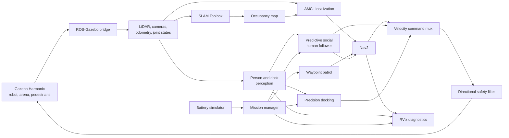

# ROS 2 Companion Robot

[](https://docs.ros.org/en/jazzy/)
[](https://gazebosim.org/docs/harmonic/getstarted/)
[](https://releases.ubuntu.com/noble/)
[](LICENSE)

An autonomous mobile companion-robot simulation built with ROS 2 Jazzy,
Gazebo Harmonic, Nav2, and SLAM Toolbox. The project combines robot modeling,
localization, navigation, mission management, energy-aware docking,
camera-and-LiDAR person perception, predictive human following, and social
safety behavior in one reproducible simulation stack.

The repository is designed as a practical learning platform and as a software
foundation for a future physical differential-drive robot.

## Highlights

### Mobile robot platform

- Parametric differential-drive robot model written in URDF/Xacro
- Gazebo physics with drive wheels and front/rear caster support
- Simulated 360-degree 2D LiDAR
- Simulated front and rear RGB cameras
- Gazebo pose odometry and separate encoder-style wheel odometry
- Safe `W`, `A`, `S`, `D` terminal teleoperation

### Mapping and autonomous navigation

- Online 2D mapping with SLAM Toolbox
- Saved occupancy map and AMCL localization
- Nav2 global planning, local control, costmaps, and recovery
- Forward and limited reverse autonomous motion
- Multi-waypoint patrol and return-to-home behavior
- Direction-aware LiDAR slowdown and emergency stopping

### Docking and mission autonomy

- Reverse-entry docking station with staging and final dock poses
- Rear-camera ArUco detection for precision alignment
- Marker-loss, obstruction, and no-progress recovery
- Simulated battery discharge and accelerated charging
- Automatic low-battery docking, charging, undocking, and patrol resumption
- Mission-level health monitoring and bounded autonomous recovery

### Human-aware companion behavior

- Two independently moving pedestrian models
- Camera-and-LiDAR multi-person detection without ground-truth target poses
- Persistent identity selection for `person_alpha` and `person_beta`
- Predictive human following using filtered map-frame motion estimates
- Speed-adaptive following distance from 0.70 to 0.90 meters
- Social yielding when a person approaches the robot
- Hard minimum-distance retreat and periodic lost-target reacquisition

## System Architecture



The command mux prevents Nav2 from competing with direct behavior commands.
Every selected command still passes through velocity smoothing and
direction-aware collision protection before reaching the robot.

## Project Status

| Area | Status |
| --- | --- |
| Robot model and Gazebo simulation | Complete |
| LiDAR, cameras, odometry, and TF | Validated in simulation |
| SLAM mapping and map export | Validated in simulation |
| AMCL localization and Nav2 navigation | Validated in simulation |
| Waypoint patrol and return home | Validated in simulation |
| Camera-guided automatic docking | Validated in simulation |
| Battery-aware charging and undocking | Validated in simulation |
| Dynamic-obstacle avoidance and safety filtering | Validated in simulation |
| Mission recovery and autonomy diagnostics | Validated in simulation |
| Multi-person identity tracking | Validated in simulation |
| Predictive human following and social safety | Validated in simulation |
| Wheel encoder and IMU sensor fusion | Planned |
| Physical robot deployment | Planned |

## Repository Layout

```text
.
|-- src/
|   |-- companion_robot_description/
|   |   |-- launch/        # Standalone robot visualization
|   |   |-- rviz/          # Robot-model RViz configuration
|   |   `-- urdf/          # Parametric URDF/Xacro model
|   |-- companion_robot_gazebo/
|   |   |-- config/        # SLAM and pedestrian parameters
|   |   |-- launch/        # Arena, simulation, and mapping launches
|   |   |-- maps/          # Saved occupancy map
|   |   |-- rviz/          # Simulation and mapping views
|   |   |-- scripts/       # WASD and pedestrian controllers
|   |   `-- worlds/        # Gazebo arena
|   |-- companion_robot_navigation/
|   |   |-- config/        # AMCL, costmap, planner, and controller
|   |   |-- launch/        # Saved-map navigation launch
|   |   `-- rviz/          # Navigation and diagnostics view
|   |-- companion_robot_perception/
|   |   |-- config/        # Person and dock-marker perception
|   |   `-- scripts/       # Camera-and-LiDAR detector nodes
|   `-- companion_robot_behaviors/
|       |-- config/        # Patrol, docking, battery, mission, following
|       |-- launch/        # Integrated behavior launches
|       `-- scripts/       # Mission and behavior nodes
|-- .gitignore
|-- LICENSE
`-- README.md
```

## Requirements

- Ubuntu 24.04, natively or through WSL 2 with WSLg
- ROS 2 Jazzy
- Gazebo Harmonic
- Nav2
- SLAM Toolbox
- ROS-Gazebo integration packages
- `colcon` and `rosdep`

Package-level dependencies are declared in each `package.xml`.

## Installation

Clone and enter the repository:

```bash
git clone https://github.com/mdaninas/ros2-companion-robot.git
cd ros2-companion-robot
```

Install dependencies and build:

```bash
source /opt/ros/jazzy/setup.bash

# Run rosdep initialization only once per machine.
sudo rosdep init
rosdep update

rosdep install --from-paths src --ignore-src --rosdistro jazzy -r -y
colcon build --symlink-install
source install/setup.bash
```

If `rosdep` is already initialized, skip `sudo rosdep init`.

Every new terminal must source ROS 2 and the workspace:

```bash
source /opt/ros/jazzy/setup.bash
source install/setup.bash
```

## Quick Start

Run only **one main launch file at a time**. Integrated behavior launches
already start Gazebo, the robot, localization, Nav2, perception, behavior
nodes, and RViz. Starting a second arena or navigation launch creates
competing robot processes and duplicate TF trees.

| Goal | Command |
| --- | --- |
| Display the URDF model | `ros2 launch companion_robot_description display.launch.py` |
| Start the Gazebo arena | `ros2 launch companion_robot_gazebo arena.launch.py` |
| Create a map | `ros2 launch companion_robot_gazebo mapping.launch.py` |
| Run saved-map navigation | `ros2 launch companion_robot_navigation navigation.launch.py` |
| Run waypoint patrol | `ros2 launch companion_robot_behaviors patrol.launch.py` |
| Test automatic docking | `ros2 launch companion_robot_behaviors docking.launch.py` |
| Run energy-aware patrol | `ros2 launch companion_robot_behaviors energy_patrol.launch.py` |
| Run predictive human following | `ros2 launch companion_robot_behaviors human_following.launch.py` |

Most demonstrations use two terminals:

| Terminal | Purpose |
| --- | --- |
| Terminal 1 | Keep one complete launch running |
| Terminal 2 | Send service requests or inspect status |

Terminal 2 is only a control and diagnostics console; it does not start a
second robot.

## Core Workflows

### Manual driving

Start the arena in Terminal 1:

```bash
ros2 launch companion_robot_gazebo arena.launch.py
```

Run the keyboard controller in Terminal 2:

```bash
ros2 run companion_robot_gazebo wasd_teleop
```

| Key | Action |
| --- | --- |
| `W` | Move forward |
| `S` | Move backward |
| `A` | Rotate left |
| `D` | Rotate right |
| `Space` | Stop |
| `Q` | Stop and exit |

The controller has a command timeout, so interrupted keyboard input produces
a safe stop.

### Mapping with SLAM Toolbox

Start mapping:

```bash
ros2 launch companion_robot_gazebo mapping.launch.py
```

Run `wasd_teleop` in Terminal 2 and drive slowly around the arena. Scan the
perimeter, avoid collisions, and revisit the starting area to allow loop
closure.

Save the resulting occupancy map:

```bash
ros2 run nav2_map_server map_saver_cli \
  -f "$PWD/src/companion_robot_gazebo/maps/companion_arena"
```

This creates:

```text
src/companion_robot_gazebo/maps/companion_arena.pgm
src/companion_robot_gazebo/maps/companion_arena.yaml
```

The SLAM Toolbox RViz panel can also save the map. Use **Serialize Map** only
when the pose graph is needed for a future mapping session.

### Autonomous navigation

```bash
ros2 launch companion_robot_navigation navigation.launch.py
```

The robot spawns at `(0, 0, 0)`, and AMCL is initialized to the same pose.
Use **2D Pose Estimate** in RViz if localization must be corrected, then place
a target with **Nav2 Goal**.

Do not run teleoperation while Nav2 is controlling the robot.

### Waypoint patrol and return home

Start a single patrol loop:

```bash
ros2 launch companion_robot_behaviors patrol.launch.py
```

Set a finite number of loops or repeat indefinitely:

```bash
ros2 launch companion_robot_behaviors patrol.launch.py loop_count:=2
ros2 launch companion_robot_behaviors patrol.launch.py loop_count:=0
```

Return home from Terminal 2:

```bash
ros2 service call /return_home std_srvs/srv/Trigger "{}"
```

Patrol poses and the home pose are configured in
`src/companion_robot_behaviors/config/patrol.yaml`.

### Automatic docking

Start the docking stack:

```bash
ros2 launch companion_robot_behaviors docking.launch.py
```

Request docking from Terminal 2:

```bash
ros2 service call /dock_robot std_srvs/srv/Trigger "{}"
```

Nav2 first moves the robot to the staging pose. A bounded precision controller
then uses the rear camera and ArUco marker to reverse into the docking station.
The rear LiDAR remains active as an emergency stop, while the saved map pose
provides an independent final-position check.

Expected states include:

```text
NAVIGATING_TO_STAGING
ALIGNING_WITH_DOCK
ACQUIRING_DOCK_MARKER
PRECISION_DOCKING
DOCKED
CHARGING
FULLY_CHARGED
```

If the marker is briefly hidden, the robot stops before attempting bounded
recovery. Obstruction, camera/map disagreement, or no progress eventually
reports `ERROR`.

Request undocking when at least 50% charge is available:

```bash
ros2 service call /undock_robot std_srvs/srv/Trigger "{}"
```

The robot exits forward and stops at the staging pose. The front LiDAR blocks
undocking when the exit is unsafe.

### Energy-aware patrol

Start the complete patrol, battery, and docking workflow:

```bash
ros2 launch companion_robot_behaviors energy_patrol.launch.py
```

Trigger a low-battery demonstration:

```bash
ros2 service call /simulate_low_battery std_srvs/srv/Trigger "{}"
```

The service sets the battery below the configured threshold. The mission
manager then pauses patrol, docks, charges to 100%, undocks, retries the saved
waypoint, and resumes the route automatically.

Inspect mission and system health:

```bash
ros2 service call /get_mission_status std_srvs/srv/Trigger "{}"
ros2 service call /get_autonomy_health std_srvs/srv/Trigger "{}"
```

After correcting the physical cause of a terminal error, reset recovery
counters with:

```bash
ros2 service call /recover_mission std_srvs/srv/Trigger "{}"
```

### Predictive human following

Start the complete human-following stack:

```bash
ros2 launch companion_robot_behaviors human_following.launch.py
```

The purple pedestrian is `person_alpha`; the blue pedestrian is
`person_beta`. The detector combines camera bearing with LiDAR range and does
not consume either pedestrian's ground-truth Gazebo pose.

The follower:

- locks onto one selected identity;
- estimates filtered human velocity in the `map` frame;
- predicts a bounded future position after consistent observations;
- places its Nav2 goal behind the direction of human travel;
- keeps 0.70 meters from a stationary person;
- increases the gap gradually to at most 0.90 meters while the person moves;
- yields translation while continuing to face an approaching person;
- retreats when the measured distance falls below 0.58 meters; and
- searches the predicted last-seen direction without switching identity.

Inspect the follower:

```bash
ros2 service call /get_human_following_status std_srvs/srv/Trigger "{}"
ros2 service call /get_person_targets std_srvs/srv/Trigger "{}"
```

Select the next identity:

```bash
ros2 service call /cycle_person_target std_srvs/srv/Trigger "{}"
```

Pause or resume either simulated person:

```bash
ros2 service call /set_person_alpha_enabled \
  std_srvs/srv/SetBool "{data: false}"

ros2 service call /set_person_alpha_enabled \
  std_srvs/srv/SetBool "{data: true}"
```

Replace `alpha` with `beta` for the blue pedestrian.

#### RViz marker legend

| Marker | Meaning |
| --- | --- |
| Purple cylinder | Current measured person position |
| Green sphere | Bounded predicted person position |
| Green arrow | Estimated person velocity and direction |
| Orange sphere | Temporary Nav2 following goal |
| Translucent yellow circle | Current social-distance radius |

The orange goal is visible only while the follower is sending a Nav2 goal. It
normally disappears during turning, holding, yielding, retreating, or target
search.

#### Expected following states

| State | Meaning |
| --- | --- |
| `SEARCHING` | Waiting for the selected identity |
| `TURNING_TO_PERSON` | Rotating the front camera toward the target |
| `FOLLOWING` | Moving toward a direct safe following goal |
| `PREDICTIVE_FOLLOWING` | Trailing a motion-predicted target |
| `HOLDING_DISTANCE` | Correct following distance reached |
| `SOCIAL_YIELDING` | Stopping translation for an approaching person |
| `RETREATING` | Re-establishing the hard minimum distance |
| `SEARCHING_LAST_SEEN` | Facing the predicted last-seen position |
| `SEARCHING_SWEEP` | Performing a bounded local sweep |
| `SEARCHING_REACQUIRE` | Performing a periodic complete sweep |
| `TARGET_LOST` | Waiting safely between reacquisition attempts |

Short transitions between these states are normal as the person changes
direction or leaves the camera field of view.

#### Manual validation

For a moving person, verify that:

- the green arrow follows the sustained direction of travel;
- the predicted point remains no more than 0.35 meters ahead;
- the orange goal trails rather than cuts across the person's route;
- the effective following distance stays between 0.70 and 0.90 meters;
- `SOCIAL_YIELDING` stops translation but still permits facing rotation; and
- `RETREATING` remains active until the distance recovers to 0.66 meters.

For a stationary-person test, pause the selected pedestrian, wait three
seconds, and inspect `/get_human_following_status`. `target_speed` should
approach zero, `effective_follow_distance` should return to `0.70`, and the
state should settle at `HOLDING_DISTANCE`.

## Configuration

| File | Purpose |
| --- | --- |
| `src/companion_robot_description/urdf/companion_robot.urdf.xacro` | Robot geometry, joints, sensors, and Gazebo plugins |
| `src/companion_robot_gazebo/config/slam.yaml` | SLAM Toolbox parameters |
| `src/companion_robot_gazebo/config/moving_obstacle.yaml` | Pedestrian routes and safety behavior |
| `src/companion_robot_navigation/config/nav2_params.yaml` | AMCL, planners, controllers, costmaps, and recovery |
| `src/companion_robot_behaviors/config/patrol.yaml` | Waypoints, loop count, and home pose |
| `src/companion_robot_behaviors/config/docking.yaml` | Staging, dock, precision control, and recovery |
| `src/companion_robot_behaviors/config/battery.yaml` | Battery rates and low-charge thresholds |
| `src/companion_robot_behaviors/config/mission.yaml` | Mission policy and recovery limits |
| `src/companion_robot_behaviors/config/following.yaml` | Following distance, prediction, search, and social safety |
| `src/companion_robot_perception/config/person_detector.yaml` | Person identities and camera/LiDAR fusion |
| `src/companion_robot_perception/config/dock_marker.yaml` | ArUco detection and visibility thresholds |

## Main ROS Interfaces

### Core topics

| Topic | Type | Purpose |
| --- | --- | --- |
| `/cmd_vel` | `geometry_msgs/msg/Twist` | Final robot velocity |
| `/scan` | `sensor_msgs/msg/LaserScan` | Simulated 2D LiDAR |
| `/odom` | `nav_msgs/msg/Odometry` | Noisy Gazebo pose odometry |
| `/wheel_odom` | `nav_msgs/msg/Odometry` | Encoder-style wheel odometry |
| `/map` | `nav_msgs/msg/OccupancyGrid` | Occupancy map |
| `/front_camera/image_raw` | `sensor_msgs/msg/Image` | Front perception camera |
| `/rear_camera/image_raw` | `sensor_msgs/msg/Image` | Rear docking camera |
| `/battery_state` | `sensor_msgs/msg/BatteryState` | Simulated battery state |
| `/mission_status` | `std_msgs/msg/String` | High-level mission state |
| `/autonomy/health` | `std_msgs/msg/String` | Combined autonomy health |
| `/diagnostics` | `diagnostic_msgs/msg/DiagnosticArray` | Detailed subsystem health |

### Person-perception and following topics

| Topic | Type | Purpose |
| --- | --- | --- |
| `/person_detection/pose` | `geometry_msgs/msg/PoseStamped` | Selected target pose in the robot frame |
| `/person_detection/selected_identity` | `std_msgs/msg/String` | Selected person identity |
| `/person_detection/tracks` | `std_msgs/msg/String` | JSON snapshot of current identity tracks |
| `/person_detection/debug_image` | `sensor_msgs/msg/Image` | Annotated front-camera image |
| `/human_following/status` | `std_msgs/msg/String` | Current following state |
| `/human_following/predicted_target` | `geometry_msgs/msg/PoseStamped` | Predicted target in the map frame |
| `/human_following/target_velocity` | `geometry_msgs/msg/TwistStamped` | Filtered target velocity |
| `/human_following/effective_distance` | `std_msgs/msg/Float32` | Current adaptive following distance |
| `/human_following/visualization` | `visualization_msgs/msg/MarkerArray` | RViz target, prediction, velocity, and goal |

### Primary services

| Service | Purpose |
| --- | --- |
| `/return_home` | Interrupt patrol and navigate home |
| `/dock_robot` | Start automatic docking |
| `/undock_robot` | Leave the dock for the staging pose |
| `/simulate_low_battery` | Trigger the low-battery demonstration |
| `/get_mission_status` | Return mission and subsystem state |
| `/get_autonomy_health` | Return combined autonomy health |
| `/recover_mission` | Reset recovery limits and retry |
| `/get_person_targets` | Return selected identity and active tracks |
| `/cycle_person_target` | Select the next person identity |
| `/get_human_following_status` | Return following and prediction details |
| `/start_human_following` | Enable human following |
| `/stop_human_following` | Stop following safely |

## Troubleshooting

### RViz reports that a frame does not exist

Short frame warnings are normal during startup. If the warning remains after
Nav2 is active:

1. Stop the launch with `Ctrl+C`.
2. Confirm that no other companion-robot launch is running.
3. Source ROS 2 and the workspace again.
4. Start one main launch file.

Duplicate arena or navigation launches are the most common cause of persistent
TF conflicts.

### Recent source changes do not appear

Rebuild the affected package, source the workspace, and restart the launch:

```bash
colcon build --symlink-install --packages-select \
  companion_robot_description companion_robot_gazebo \
  companion_robot_navigation companion_robot_perception \
  companion_robot_behaviors

source install/setup.bash
```

Running Python and launch processes do not reload edited files automatically.

### The robot is stationary

Inspect `/get_human_following_status` or `/get_mission_status`. A stationary
robot can be correct in states such as `HOLDING_DISTANCE`, `SOCIAL_YIELDING`,
`TARGET_LOST`, `CHARGING`, or a collision-safety stop. Treat a persistent
`ERROR`, stale sensors, or a state that never progresses as a fault.

### Gazebo opens but `gz` is not found

Source ROS 2 in the current terminal:

```bash
source /opt/ros/jazzy/setup.bash
```

### RViz renders the robot with dark materials under WSLg

Use software rendering:

```bash
ros2 launch companion_robot_description display.launch.py \
  rviz_software_rendering:=true
```

## Known Limitations

- The complete stack has been validated in simulation, not on physical
  hardware.
- Person identities currently use configured clothing colors rather than a
  general-purpose human re-identification model.
- `/odom` still originates from a noisy Gazebo pose estimate; wheel encoder
  and IMU fusion is the next localization milestone.
- Battery, charging contacts, and dock-marker lighting remain simulated.

## Roadmap

1. Add simulated IMU data and fuse it with wheel odometry using an EKF.
2. Validate camera-guided docking under stronger lighting and occlusion
   changes.
3. Add human-aware passing-side selection for shared navigation spaces.
4. Introduce gesture or command-based companion interaction.
5. Create a hardware abstraction layer and deploy to a physical robot.

## Contributing

Issues and pull requests are welcome. Keep changes focused, document new ROS
interfaces and parameters, and include the launch command used for validation.

## License

Licensed under the Apache License 2.0. See [LICENSE](LICENSE).
